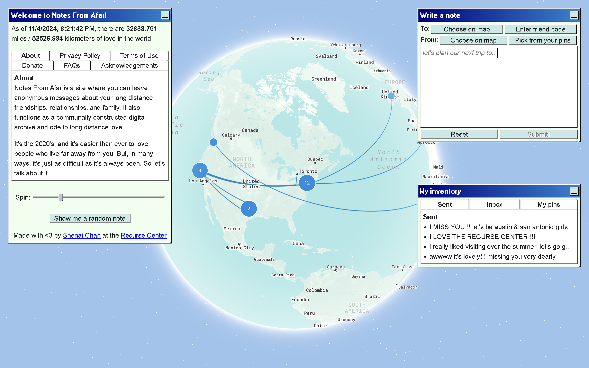

<h2 align="center"><i>Notes From Afar</i></h2>

  <a href="https://opensource.org/licenses/MIT">
    
  <a>
    

### Intro
Notes From Afar is a site where you can leave anonymous messages about your long distance friendships, relationships, and family. It also functions as a communally constructed digital archive and ode to long distance love. It's the 2020's, and it's easier than ever to love people who live far away from you, but it's still incredibly difficult. So let's talk about it.

### Built With
- 
- 
- 
- 
- 
- 

## Table of Contents
- [Features](#features)
- [High-Level Design Considerations](#high-level-design-considerations)
- [UI/UX](#ui-ux)
- [Frontend Architecture](#frontend-architecture)
- [Backend Architecture](#backend-architecture)
- [Database Design](#database-design)
- [Acknowledgements](#acknowledgements)
- [License](#license)

## Features

## High-Level Design Considerations

## UI/UX

## Frontend Architecture

## Backend Architecture

## Database Design

## Acknowledgements

## License

